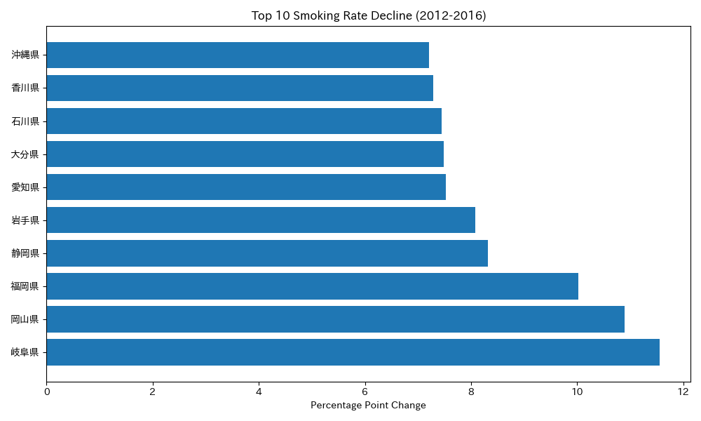
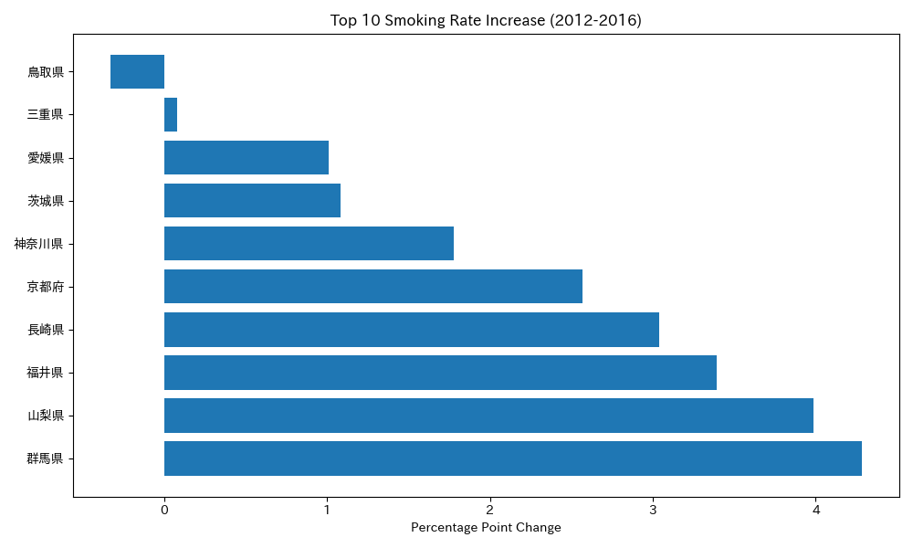

# commercial-analytics-case-study
Commercial analytics case studies using public datasets to demonstrate business question framing, hypothesis validation, data storytelling, and decision support.

## Top Smoking Rate Decline

## Top Smoking Rate Increase

